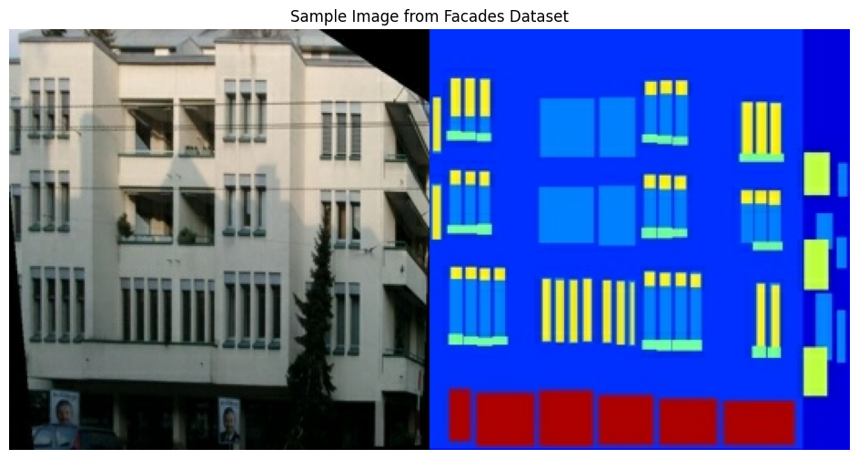
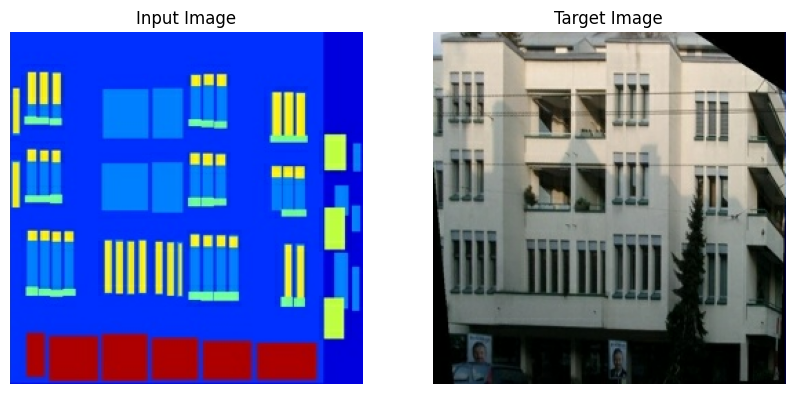
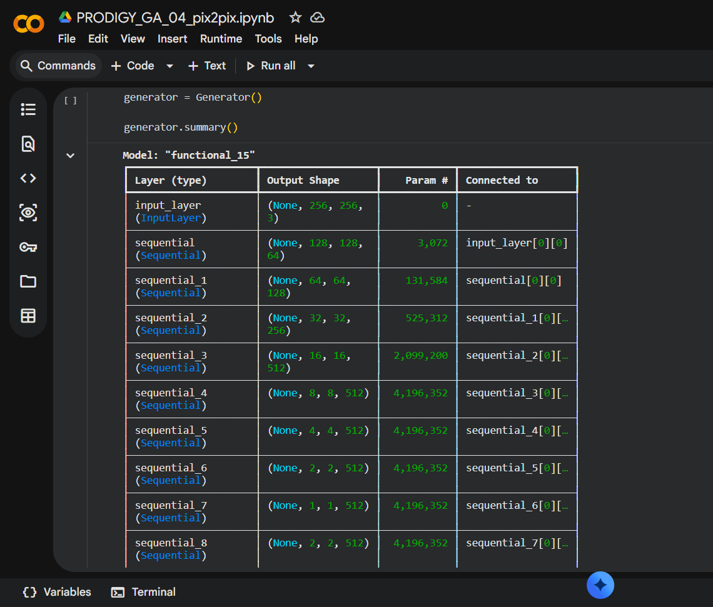
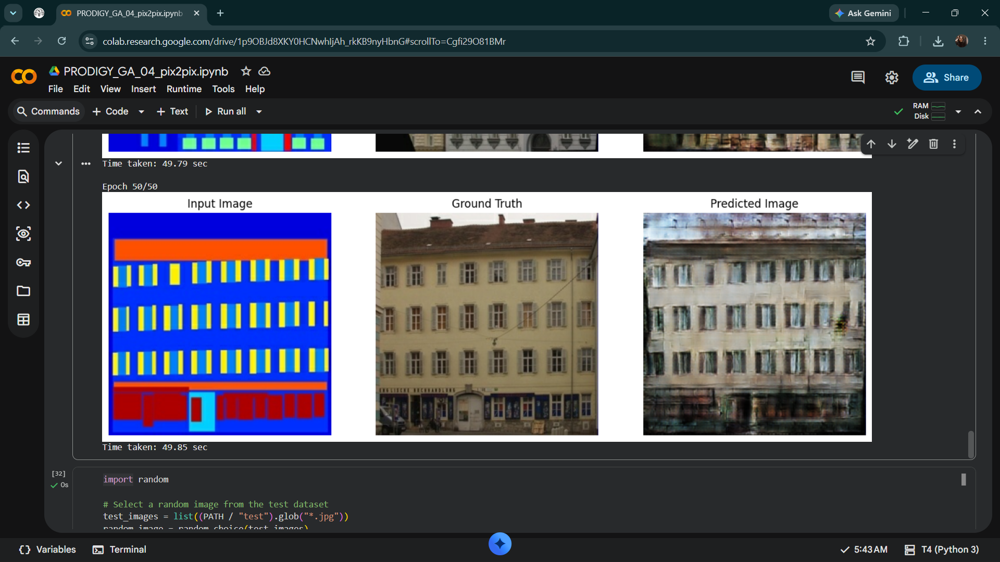

# Task 4: Image-to-Image Translation using Conditional GAN (pix2pix)

> **Task 04 - Generative AI Internship @ Prodigy InfoTech**

This project implements an **Image-to-Image Translation** model using a **Conditional Generative Adversarial Network (cGAN)** based on the **pix2pix** architecture. The model learns to translate semantic building facade labels into realistic building photographs using paired image datasets.

---

### Project Overview

The objective of this project is to understand and implement the pix2pix framework for image-to-image translation. Unlike traditional GANs that generate images from random noise, pix2pix learns a mapping from an input image to a target image using paired training examples.

In this implementation, the model was trained on the **CMP Facades Dataset**, where:

- **Input:** Building Facade Label Map
- **Output:** Real Building Photograph

The project demonstrates how Conditional GANs can learn structured image translations while preserving spatial information.

### Features

- Implementation of the **pix2pix Conditional GAN (cGAN)** architecture.
- U-Net based Generator for high-quality image translation.
- PatchGAN Discriminator for evaluating local image realism.
- Image preprocessing and normalization pipeline using TensorFlow.
- Training on the CMP Facades paired image dataset.
- Generation of realistic building images from facade label maps.
- Visualization of training progress and generated outputs.

### Technologies Used

- Python
- TensorFlow 2.x
- Keras
- NumPy
- Matplotlib
- Google Colab
- Git & GitHub

### Dataset

**Dataset Used:** CMP Facades Dataset

The CMP Facades dataset contains paired images of building facade label maps and corresponding real-world building photographs. It is widely used for benchmarking image-to-image translation models such as pix2pix.

Each sample consists of:
- **Input Image:** Semantic facade label map
- **Target Image:** Real building photograph

### Model Architecture

The pix2pix model is based on a **Conditional Generative Adversarial Network (cGAN)** consisting of two neural networks:

#### Generator (U-Net)

- Encoder-decoder architecture with skip connections.
- Converts semantic facade label maps into realistic building images.
- Skip connections help preserve spatial information and fine details.

#### Discriminator (PatchGAN)

- Evaluates small image patches instead of the entire image.
- Distinguishes between real and generated image pairs.
- Encourages the generator to produce locally realistic outputs.

During training, the Generator and Discriminator compete with each other, gradually improving the quality of the translated images.

### Workflow

1. Load the CMP Facades paired image dataset.
2. Split each image into input (facade labels) and target (real building).
3. Resize and normalize images.
4. Build the U-Net Generator.
5. Build the PatchGAN Discriminator.
6. Define Generator and Discriminator loss functions.
7. Train the cGAN model.
8. Generate translated building images from facade label maps.
9. Visualize and evaluate the generated results.

###  Results

#### Dataset Sample

---

#### Input and Target Images

---

#### U-Net Generator Summary

---

#### Final Training Result

The generated images progressively improve during training. The model was trained for 50 epochs. The generated images successfully capture the building layout and major structural features. Additional training epochs could further improve sharpness and fine details.

### Learning Outcomes

Through this project, I learned:

- Fundamentals of Conditional GANs (cGANs).
- Working of the pix2pix architecture.
- U-Net Generator and PatchGAN Discriminator.
- Image preprocessing using TensorFlow.
- Training deep learning models on paired datasets.
- Image-to-image translation techniques.
- Managing machine learning projects using Git and GitHub.
